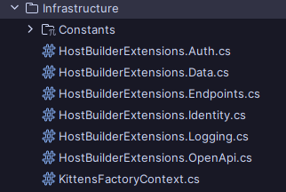

# Being "Reasonable"
Like a rubber band, you start out strong with high ambitions, and sling back towards reality. In particular, at least for the start of this fun li'l domain, I'm optimizing for local development: it's overkill for me to worry about certificates, proper identity management, and race conditions regarding multi-instance deployment, when I don't even have the damn thing done and dusted yet.

In any case, a lot's been done to make usage of the app possible, since I've decioded to incorporate ASP.NET Identity.

1. Users, orders, and kittens are seeded appropriately on-start. This is done in a transaction as part of the application's startup process before the host is ran; users are seeded if their usernames don't exist, and data is only seeded once, if no data exists. 
2. Authentication has been done via Duende IdentityServer. I've never actually implemented this from scratch before, and it is _for sure_ "extra" for me to have done this. I wanted to have full OIDC-compliant access token provisioning, not a simple `/token` endpoint where I simply used my own JwtSecurityTokenHandler and handed out tokens like candy. Learned a lot though, and I'm somewhat pleased with the results, even if a bit disgruntled at the work involved.
3. Cleanliness! I haven't seen any common patterns emerge from the community yet regarding configuration of the HostApplicationBuilder. Services sometimes need config, pipeline/app-level config depends on services and config.. middlewares almost always need to be injected in a particular order, while services need their configuration first. Separating each "area" of concern (auth/security, observability, data, open API spec) into two extension methods seems to provide a good bit of flexibility and organization.

_Chef's kiss_

# Next Steps
With a repeatable pattern for testing via Swagger, it's time to start adding some functionality - creating kittens, placing orders, and then expanding the domain a bit to include fun items like sales and order tracking. Once I have a bit of a customer flow figured out, I'll begin trying to use Claude or GPT to get a frontend, and breathe some interactive life into this API.

But before then, a small trip to Italy for a few weeks. 🍷